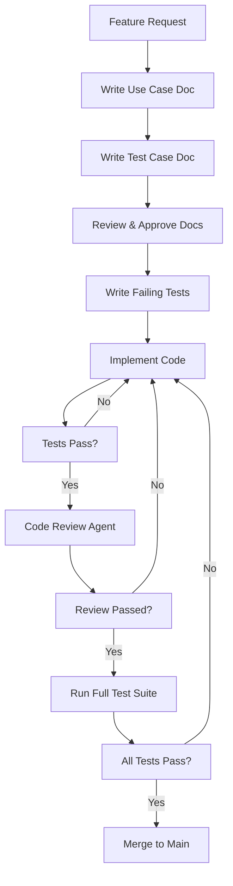

# Development Guidelines

## Table of Contents
1. [Development Workflow](#development-workflow)
2. [Test-Driven Development](#test-driven-development)
3. [Code Review Process](#code-review-process)
4. [Git Workflow](#git-workflow)
5. [Documentation Standards](#documentation-standards)
6. [Quality Gates](#quality-gates)

---

## Development Workflow

### Overview

Every feature follows a strict phase-gate process to ensure quality and maintainability.



### Phase 1: Documentation (BEFORE coding)

#### 1.1 Use Case Document

**Location**: `docs/features/{feature-number}-{feature-name}/use-case.md`

**Template**: See `docs/features/TEMPLATE-use-case.md`

**Must Include**:
- **User Story**: As a [user], I want [goal], so that [benefit]
- **Acceptance Criteria**: Clear, testable conditions
- **Success Metrics**: How to measure success
- **Edge Cases**: What could go wrong
- **Dependencies**: What this feature depends on

**Example**:
```markdown
# Feature: Git-Based Session Creation

## User Story
As a user, I want to create a new Claude Code session that automatically creates a Git branch, so that my work is isolated from other sessions.

## Acceptance Criteria
- [ ] Creating session prompts for Git repo if not present
- [ ] Session creation fails gracefully if Git init fails
- [ ] Branch name follows pattern: `session/{session-id}`
- [ ] Branch is created from `main` (or configured base branch)
- [ ] Session metadata stored in SQLite with branch name
- [ ] UI shows session is ready after branch creation

## Edge Cases
- Directory is not a Git repository → Prompt to initialize
- Git not installed → Show error with installation instructions
- Branch already exists → Generate unique branch name
- Uncommitted changes on main → Warn user
```

#### 1.2 Test Case Document

**Location**: `docs/features/{feature-number}-{feature-name}/test-case.md`

**Template**: See `docs/features/TEMPLATE-test-case.md`

**Must Include**:
- **Unit Test Cases**: Individual function tests
- **Integration Test Cases**: Component interaction tests
- **E2E Test Cases**: Full user flow tests
- **Test Data**: Sample data for testing
- **Mocks/Stubs**: What to mock

**Example**:
```markdown
# Test Cases: Git-Based Session Creation

## Unit Tests

### `GitService.checkGitInstalled()`
- ✅ Returns true when Git is installed
- ✅ Returns false when Git is not found
- ✅ Handles `which git` command errors

### `GitService.isGitRepo(directory)`
- ✅ Returns true for valid Git repo
- ✅ Returns false for non-Git directory
- ✅ Returns false for non-existent directory

### `SessionService.createSession()`
- ✅ Creates session with valid Git repo
- ✅ Throws error when Git not initialized
- ✅ Creates unique branch name
- ✅ Stores session in database
- ✅ Returns session object

## Integration Tests

### Session Creation Flow
- ✅ API POST /api/sessions creates session and Git branch
- ✅ Database record matches Git branch state
- ✅ Session appears in session list API

## E2E Tests

### Happy Path: Create New Session
1. User clicks "New Session" button
2. User selects directory with Git repo
3. User enters session title
4. User clicks "Create"
5. **Assert**: Session appears in sidebar
6. **Assert**: Git branch `session/{id}` exists
7. **Assert**: Chat interface is ready

### Error Path: No Git Repository
1. User clicks "New Session" button
2. User selects directory WITHOUT Git
3. **Assert**: Dialog shows "Initialize Git repository?"
4. User clicks "Yes"
5. **Assert**: Git initialized (`git init` runs)
6. **Assert**: Session creation continues
```

### Phase 2: Test-Driven Development (TDD)

#### 2.1 Write Failing Tests First

Before writing ANY implementation code:

```bash
# Create test file
touch apps/server/src/services/session-service.test.ts

# Write tests that describe expected behavior
# Run tests - they should FAIL
pnpm test:unit
```

**Example Test (Before Implementation)**:
```typescript
// session-service.test.ts
import { describe, it, expect, beforeEach } from 'vitest';
import { SessionService } from './session-service';

describe('SessionService', () => {
  let sessionService: SessionService;

  beforeEach(() => {
    sessionService = new SessionService();
  });

  describe('createSession', () => {
    it('should create session with Git branch', async () => {
      const result = await sessionService.createSession({
        title: 'Test Session',
        rootDirectory: '/path/to/repo'
      });

      expect(result.id).toBeDefined();
      expect(result.branchName).toMatch(/^session\//);
      expect(result.title).toBe('Test Session');
    });

    it('should throw error if directory is not Git repo', async () => {
      await expect(
        sessionService.createSession({
          title: 'Test',
          rootDirectory: '/not/a/git/repo'
        })
      ).rejects.toThrow('Not a Git repository');
    });
  });
});
```

#### 2.2 Write Minimal Implementation

Write just enough code to make tests pass:

```typescript
// session-service.ts
export class SessionService {
  async createSession(params: CreateSessionParams): Promise<Session> {
    // Check if Git repo
    const isGitRepo = await this.gitService.isGitRepo(params.rootDirectory);
    if (!isGitRepo) {
      throw new Error('Not a Git repository');
    }

    // Create branch
    const sessionId = generateId();
    const branchName = `session/${sessionId}`;
    await this.gitService.createBranch(branchName, 'main');

    // Store in DB
    const session = await this.db.insertSession({
      id: sessionId,
      title: params.title,
      rootDirectory: params.rootDirectory,
      branchName,
    });

    return session;
  }
}
```

#### 2.3 Run Tests, Refactor, Repeat

```bash
# Run tests
pnpm test:unit

# All pass? Refactor to improve code quality
# Then run tests again to ensure nothing broke
```

### Phase 3: Code Review

#### 3.1 Automated Code Review

Use the `code-reviewer` agent to analyze code:

```bash
# Option 1: Use slash command
/review-ready

# Option 2: Manual agent invocation
# (Agent will check: code quality, security, patterns, tests)
```

#### 3.2 Code Review Checklist

The code reviewer checks:

- ✅ **Tests exist and pass**: Every function has tests
- ✅ **Type safety**: No `any`, proper types
- ✅ **Error handling**: Try-catch where needed
- ✅ **Security**: No secrets, SQL injection, XSS
- ✅ **Performance**: No obvious bottlenecks
- ✅ **Code style**: Follows project standards
- ✅ **Documentation**: JSDoc for public APIs

#### 3.3 Fix Issues

If code review finds issues:

1. Fix the issues
2. Update tests if needed
3. Run tests again
4. Re-run code review
5. Repeat until clean

### Phase 4: Full Test Suite

Before merging, run ALL tests:

```bash
# Run all unit tests
pnpm test:unit

# Run all e2e tests
pnpm test:e2e

# Check coverage
pnpm test:coverage

# Lint
pnpm lint
```

**Merge Criteria**:
- ✅ All unit tests pass
- ✅ All e2e tests pass
- ✅ Code coverage ≥ 80%
- ✅ No linting errors
- ✅ Code review passed

### Phase 5: Merge

Only merge when all quality gates pass:

```bash
# Ensure you're on your feature branch
git branch --show-current
# Output: session/sess_abc123

# Run final checks
pnpm test && pnpm lint

# If all pass, merge to main
git checkout main
git merge session/sess_abc123

# Push to remote (if using remote)
git push origin main

# Optional: Delete session branch
git branch -d session/sess_abc123
```

---

## Test-Driven Development

### TDD Cycle

```
1. RED    → Write a failing test
2. GREEN  → Write minimal code to pass
3. REFACTOR → Improve code quality
4. REPEAT → Next test
```

### Unit Test Best Practices

#### Structure: Arrange-Act-Assert

```typescript
it('should calculate total price with tax', () => {
  // Arrange
  const cart = new ShoppingCart();
  cart.addItem({ price: 100, quantity: 2 });

  // Act
  const total = cart.calculateTotal(0.1); // 10% tax

  // Assert
  expect(total).toBe(220); // (100 * 2) * 1.1
});
```

#### Use Descriptive Test Names

```typescript
// ❌ Bad
it('works', () => { /* ... */ });

// ✅ Good
it('should return 404 when session does not exist', () => { /* ... */ });
```

#### Test One Thing Per Test

```typescript
// ❌ Bad - Tests multiple things
it('should create session and delete session', async () => {
  const session = await createSession();
  expect(session).toBeDefined();
  await deleteSession(session.id);
  expect(await getSession(session.id)).toBeNull();
});

// ✅ Good - Separate tests
it('should create session', async () => {
  const session = await createSession();
  expect(session).toBeDefined();
});

it('should delete session', async () => {
  const session = await createSession();
  await deleteSession(session.id);
  expect(await getSession(session.id)).toBeNull();
});
```

#### Mock External Dependencies

```typescript
import { vi } from 'vitest';

it('should call Anthropic API', async () => {
  // Mock the SDK
  const mockQuery = vi.fn().mockResolvedValue({
    content: 'Hello!'
  });

  const agent = new ClaudeAgent({
    query: mockQuery
  });

  await agent.sendMessage('Hi');

  expect(mockQuery).toHaveBeenCalledWith('Hi');
});
```

### E2E Test Best Practices

#### Test Critical User Flows

```typescript
// apps/desktop/e2e/session-creation.spec.ts
import { test, expect } from '@playwright/test';

test('user can create new session', async ({ page }) => {
  // Navigate to app
  await page.goto('http://localhost:3000');

  // Click "New Session" button
  await page.click('button:has-text("New Session")');

  // Fill in session details
  await page.fill('input[name="title"]', 'My Test Session');
  await page.fill('input[name="directory"]', '/path/to/repo');

  // Submit
  await page.click('button:has-text("Create")');

  // Assert session appears in list
  await expect(page.locator('.session-item:has-text("My Test Session")')).toBeVisible();
});
```

#### Use Page Object Pattern

```typescript
// e2e/pages/session-page.ts
export class SessionPage {
  constructor(private page: Page) {}

  async createSession(title: string, directory: string) {
    await this.page.click('button:has-text("New Session")');
    await this.page.fill('input[name="title"]', title);
    await this.page.fill('input[name="directory"]', directory);
    await this.page.click('button:has-text("Create")');
  }

  async getSessionByTitle(title: string) {
    return this.page.locator(`.session-item:has-text("${title}")`);
  }
}

// Use in tests
test('create session', async ({ page }) => {
  const sessionPage = new SessionPage(page);
  await sessionPage.createSession('Test', '/repo');
  expect(await sessionPage.getSessionByTitle('Test')).toBeVisible();
});
```

---

## Code Review Process

### Automated Review Agent

The `code-reviewer` agent checks:

1. **Code Quality**
   - Complexity (cyclomatic)
   - Duplication
   - Dead code

2. **Security**
   - SQL injection risks
   - XSS vulnerabilities
   - Exposed secrets
   - Unsafe dependencies

3. **Best Practices**
   - Design patterns
   - SOLID principles
   - DRY violations

4. **Testing**
   - Test coverage
   - Missing tests
   - Test quality

### Manual Review Checklist

After automated review, check:

- [ ] **Logic is sound**: Code does what it's supposed to
- [ ] **Edge cases handled**: Error conditions covered
- [ ] **Performance acceptable**: No obvious bottlenecks
- [ ] **Readable**: Clear variable names, good structure
- [ ] **Documented**: Complex logic has comments

---

## Git Workflow

### Branch Strategy

```
main
 ├─ session/sess_abc123  ← Active development session
 ├─ session/sess_def456  ← Another session
 └─ session/sess_ghi789  ← Yet another session
```

### Creating a Session Branch

```bash
# Automatic (via app)
# App creates: session/sess_{uuid}

# Manual (for testing)
git checkout -b session/test_manual_session main
```

### Switching Sessions

```bash
# Via app: User selects different session from list
# Backend runs:
git checkout session/sess_def456
```

### Merging Session to Main

```bash
# After all tests pass
git checkout main
git merge session/sess_abc123
git push origin main

# Optional: Keep branch for history
# Or delete if no longer needed
git branch -d session/sess_abc123
```

### Commit Message Format

```
<type>(<scope>): <subject>

<body>

<footer>
```

**Types**: `feat`, `fix`, `docs`, `test`, `refactor`, `chore`

**Examples**:
```
feat(sessions): add Git branch creation on session init

- Check if directory is Git repo
- Create branch with session ID
- Store branch name in database

Closes #123
```

```
fix(git): handle repositories with no commits

When a repo is freshly initialized, there's no main branch yet.
Now we check if any commits exist before creating session branch.
```

---

## Documentation Standards

### Code Documentation

#### JSDoc for Public APIs

```typescript
/**
 * Creates a new Claude Code session with isolated Git branch.
 *
 * @param params - Session creation parameters
 * @param params.title - Human-readable session title
 * @param params.rootDirectory - Absolute path to Git repository
 * @param params.baseBranch - Branch to create session from (default: 'main')
 * @returns Promise resolving to created session object
 * @throws {NotGitRepoError} If directory is not a Git repository
 * @throws {GitBranchExistsError} If session branch already exists
 *
 * @example
 * ```typescript
 * const session = await sessionService.createSession({
 *   title: 'Add authentication',
 *   rootDirectory: '/Users/me/my-project'
 * });
 * ```
 */
export async function createSession(params: CreateSessionParams): Promise<Session> {
  // Implementation
}
```

#### Inline Comments for Complex Logic

```typescript
// Calculate session timeout based on last activity
// Formula: base timeout (30 min) + extension per message (5 min)
// Capped at max timeout (2 hours)
const timeoutMs = Math.min(
  BASE_TIMEOUT + (messageCount * MESSAGE_EXTENSION),
  MAX_TIMEOUT
);
```

### Feature Documentation

Every feature needs three documents:

1. **use-case.md** - What and why
2. **test-case.md** - How to test
3. **implementation.md** - Technical details

### Architecture Documentation

Keep `docs/architecture/` updated:

- **system-overview.md** - High-level architecture
- **git-session-strategy.md** - Git branching approach
- **api-design.md** - API endpoints and contracts
- **data-model.md** - Database schema

---

## Quality Gates

### Pre-Commit

```bash
# Run automatically with git hooks (husky)
pnpm lint
pnpm typecheck
pnpm test:unit --changed
```

### Pre-Merge

```bash
# Must pass before merging to main
pnpm test:unit
pnpm test:e2e
pnpm test:coverage
pnpm lint
```

**Minimum Coverage**: 80%

### CI/CD Pipeline

```yaml
# .github/workflows/test.yml
name: Test
on: [push, pull_request]

jobs:
  test:
    runs-on: ubuntu-latest
    steps:
      - uses: actions/checkout@v3
      - uses: pnpm/action-setup@v2
      - run: pnpm install
      - run: pnpm lint
      - run: pnpm typecheck
      - run: pnpm test:unit
      - run: pnpm test:e2e
      - run: pnpm test:coverage
```

---

## Summary Checklist

Before claiming a feature is "done":

- [ ] Use case document written
- [ ] Test case document written
- [ ] Unit tests written (TDD)
- [ ] Implementation complete
- [ ] All unit tests pass
- [ ] E2E tests written and pass
- [ ] Code coverage ≥ 80%
- [ ] Code review agent passed
- [ ] No linting errors
- [ ] Documentation updated
- [ ] Manual testing done
- [ ] Merged to main

**Remember**: It's not done until it's tested, reviewed, and documented!
